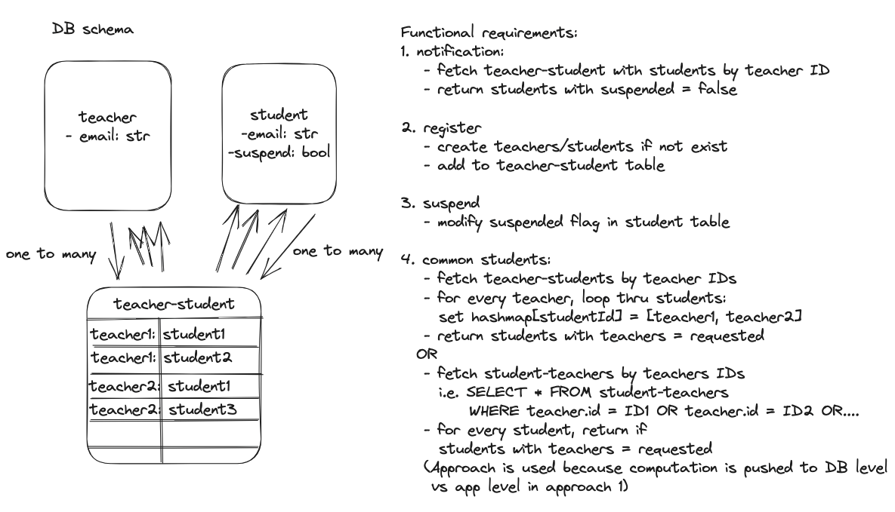

# Teacher-Student Registration Service 


### To troubleshoot having multiple node versions installed and not using the correct version
- install `nvm`
- to access `nvm` from console, sometimes need to export the part:
```
export NVM_DIR="$HOME/.nvm"
[ -s "$NVM_DIR/nvm.sh" ] && \. "$NVM_DIR/nvm.sh"
```

## High Level Design


## TypeORM
- We are using the `Many-to-many relationship` functionality in `typeorm` to simplify cascading addition/removal of entities. https://orkhan.gitbook.io/typeorm/docs/many-to-many-relations


### Example to interact with the APIs in terminal
```
curl -X GET "http://localhost:8080/api/commonstudents?teacher=teacherken%40gmail.com&teacher=teacherjoe%40gmail.com"
curl -X POST "http://localhost:8080/api/register" -H "Content-Type: application/json" -d '{ "teacher": "teacherken@gmail.com","students":["studentjon@gmail.com","studenthon@gmail.com"]}' 
curl -X POST "http://localhost:8080/api/suspend" -H "Content-Type: application/json" -d '{"student" : "studentmary@gmail.com"}' 
curl -X POST "http://localhost:8080/api/retrievefornotifications" -H "Content-Type: application/json" -d '{"teacher":  "teacherken@gmail.com","notification": "Hello students! @studentagnes@gmail.com @studentmiche@gmail.com"}' 
```

