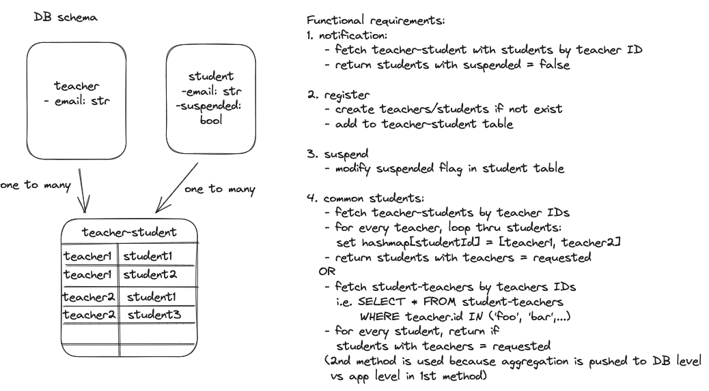

# Teacher-Student Registration Service 
The solutions to both questions were written in Typescript and run in NodeJS.
Please refer to https://gist.github.com/d3hiring/4d1415d445033d316c36a56f0953f4ef for specific requirements.


## Dependencies
### Docker
Docker is used and running `docker-compose up` spins up the server at `localhost:8080` for the **Teacher-student-registration** service and **MySQL** database server at `localhost:3306`. Install docker at https://docs.docker.com/desktop/install/mac-install/

### Node
`node@^16.10.0` is used and can be downloaded at https://nodejs.org/en/download/ (the testing framework `jest` requires `^16.10.0`).
Then, run `npm install -g yarn` to install yarn which is used as an alternative to NPM because of its speed. Run `yarn install` to install dependencies. `node` installation can be skipped if we just want to run the server for testing purpose.

### Express
`express` is a light weight library to build an API. https://expressjs.com/

### TypeORM
`typeorm` is used to handle DB schema, migrations, ORM with the SQL database and is a widely used ORM tool for typescript.
We are also leveraging on the `Many-to-many relationship` functionality in `typeorm` to manage `teacher-student-registration` without having to create the relationship table specifically. https://orkhan.gitbook.io/typeorm/docs/many-to-many-relations

## High Level Design


## Running the server and MySQL database
1. `docker-compose up` (first time running it might take a while because `MySQL` image needs to be pulled and the server code needs to be containerized)

## Local Development
1. `yarn test` to run tests
1. `yarn build` to compile typescript files to javascript
1. `yarn start` to run the server at `localhost:8080`
1. `yarn start-js` to run the server using compiled JS code at `localhost:8080` (mainly used after compiling and containerizing the code)

### Folder structure
```
-- src
   |-- tests // test folder
   |-- db // handles db schema and helper tool
   |-- controller.ts // orchestration logic with minimum biz logic
   |-- db-config.ts // DB configuration
   |-- handler // generic API handler wrapper
   |-- index.ts // entry point of web application - only program init with environment variables, and endpoint set ups.
   |-- service.ts // main biz logic and DB persistence logic
```

### To troubleshoot having multiple node versions installed and not using the correct version
- install `nvm`
- to access `nvm` from console, sometimes need to export the part:
```
export NVM_DIR="$HOME/.nvm"
[ -s "$NVM_DIR/nvm.sh" ] && \. "$NVM_DIR/nvm.sh"
```

### Examples to interact with the APIs in terminal
```
curl -X POST "http://localhost:8080/api/register" -H "Content-Type: application/json" -d '{ "teacher": "teacherken@gmail.com","students":["studentjon@gmail.com","studenthon@gmail.com"]}' 
curl -X GET "http://localhost:8080/api/commonstudents?teacher=teacherken%40gmail.com&teacher=teacherjoe%40gmail.com"
curl -X POST "http://localhost:8080/api/suspend" -H "Content-Type: application/json" -d '{"student" : "studentmary@gmail.com"}' 
curl -X POST "http://localhost:8080/api/retrievefornotifications" -H "Content-Type: application/json" -d '{"teacher":  "teacherken@gmail.com","notification": "Hello students! @studentagnes@gmail.com @studentmiche@gmail.com"}' 
```

